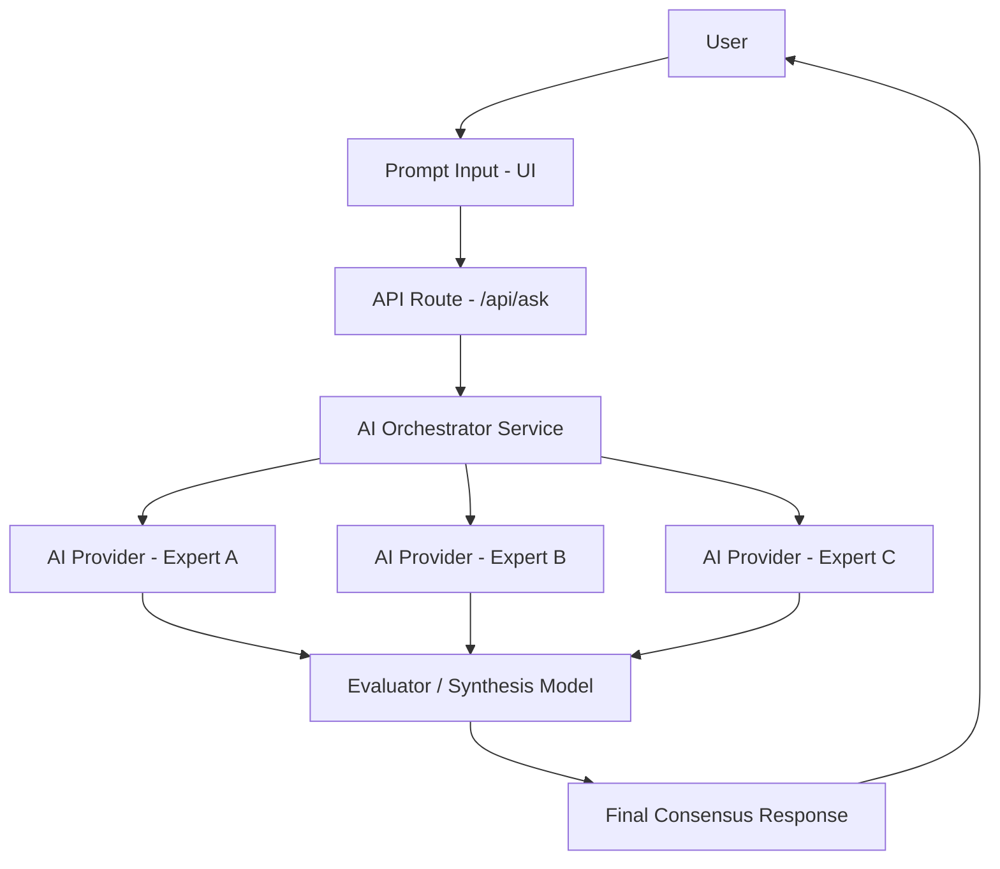
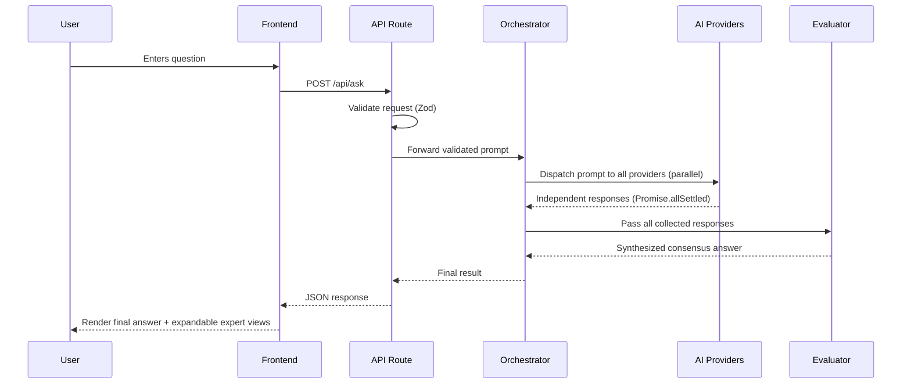
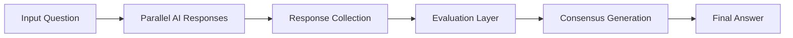

# ConsensusAI

**Multiple AI perspectives. One refined answer.**

ConsensusAI is an AI answer synthesis platform. Instead of sending a question to a single model and accepting whatever it returns, ConsensusAI dispatches the same prompt to multiple independent AI experts, collects their reasoning, and passes all of it to a dedicated evaluator model that synthesizes a single, refined consensus answer.

---

## Table of Contents

- [Why This Exists](#why-this-exists)
- [Features](#features)
- [Example Usage](#example-usage)
- [Tech Stack](#tech-stack)
- [Architecture](#architecture)
- [Request Lifecycle](#request-lifecycle)
- [Folder Structure](#folder-structure)
- [AI Pipeline](#ai-pipeline)
- [Design Decisions](#design-decisions)
- [Error Handling](#error-handling)
- [UI / UX Design](#ui--ux-design)
- [Local Setup](#local-setup)
- [Future Improvements](#future-improvements)

---

## Why This Exists

A single LLM response is a single sample from a single reasoning path. That has three practical problems:

| Problem | Consequence |
|---|---|
| **Incompleteness** | One model may miss an angle another would catch (e.g. performance vs. ecosystem vs. learning curve). |
| **Model-specific bias** | Different models are trained differently and default to different tradeoffs, even on the same prompt. |
| **No self-correction** | A single response has no mechanism to catch its own blind spots — there's nothing to check it against. |

ConsensusAI addresses this by treating "ask an AI" as a two-stage process instead of one call:

1. **Divergence** — the same question is analyzed independently by multiple AI experts, each reasoning from a distinct angle.
2. **Convergence** — a dedicated evaluator model reads all expert responses, identifies where they agree, where they conflict, and what each gets right, then produces one synthesized answer.

The result isn't "pick the best response" — it's a new response, informed by all of them.

---

## Features

- **Multi-model AI reasoning** — the same prompt is analyzed by multiple independent AI experts in parallel.
- **Independent expert perspectives** — each expert reasons in isolation, with no visibility into the others' output, to avoid anchoring bias.
- **Final answer synthesis** — a dedicated evaluator model reconciles all expert responses into one coherent answer.
- **Streaming/loading experience** — clear progressive UI state while experts respond and while synthesis runs.
- **Clean, modern interface** — minimal, distraction-free layout built around the question and the answer.
- **Expandable expert reasoning view** — the final answer is shown by default; each expert's raw reasoning is available on demand for users who want to see how the answer was formed.
- **Graceful API failure handling** — a failed provider doesn't fail the request; synthesis proceeds with whatever responses succeeded.

---

## Example Usage

**User asks:**

> Should I learn Go or Rust?

**Expert 1 (performance & systems focus):**
> Rust gives you memory safety without garbage collection, which matters if you're targeting embedded systems or performance-critical services. Go trades some of that raw control for simplicity and a much shorter time-to-productivity.

**Expert 2 (ecosystem & hiring focus):**
> Go has a larger foothold in cloud infrastructure and backend tooling (Docker, Kubernetes, Terraform are all Go). Rust's ecosystem is growing fast but is still smaller outside of systems programming and WebAssembly.

**Expert 3 (learning curve focus):**
> Go's syntax and concurrency model (goroutines, channels) are intentionally simple and can be picked up in weeks. Rust's ownership and borrow-checker model is powerful but has a steeper, often frustrating learning curve for newcomers.

**Final Consensus:**
> If your priority is fast onboarding and you're building backend services or cloud infrastructure, Go is the more pragmatic choice — its ecosystem and simplicity pay off quickly. If you're working on performance-critical or systems-level software where memory safety without a garbage collector matters, Rust is worth the steeper learning curve. For most people starting out with backend or cloud work, Go is the lower-friction path; Rust is the stronger investment if systems programming is the actual goal.

---

## Tech Stack

**Frontend**
- Next.js 16 (App Router)
- TypeScript
- Tailwind CSS
- shadcn/ui
- Lucide Icons

**AI**
- Gemini API (current provider for all roles)
- Multi-perspective expert architecture
- LLM evaluation / synthesis pipeline

**Backend**
- Next.js API Routes
- Service-based architecture

**Validation**
- Zod

---

## Architecture

ConsensusAI is built as a strict layered pipeline. Each layer has one responsibility and depends only on the layer directly below it — never on implementation details further down the stack.



### Layer responsibilities

| Layer | Responsibility | Explicitly does NOT do |
|---|---|---|
| **Route Layer** | Parses and validates the HTTP request, calls the orchestrator, maps results to an HTTP response. | Contains no business logic, no prompt construction, no provider calls. |
| **Orchestrator (Service Layer)** | Controls the AI workflow — fans requests out to providers in parallel, collects results, hands them to the evaluator. | Never talks to an SDK directly; only depends on the `AIProvider` interface. |
| **Provider Layer** | Handles communication with a single AI model (auth, request shape, retries, response normalization). | Contains no orchestration or synthesis logic — a provider only knows how to answer one prompt. |
| **Evaluator** | Compares all expert responses, identifies overlap and disagreement, and generates the final synthesized answer. | Doesn't call providers directly — it receives already-collected responses from the orchestrator. |

The critical design constraint: **the orchestrator never imports a provider SDK.** It only knows about the `AIProvider` interface. This is what makes the "Gemini for everything today, mixed providers later" migration a config change rather than a rewrite.

---

## Request Lifecycle



A single failed provider does not interrupt this flow — the orchestrator uses `Promise.allSettled`, so the evaluator receives whatever subset of responses succeeded, along with which experts failed.

---

## AI Architecture

This is the part of the project that isn't UI or CRUD — it's the actual engineering problem. Anyone can call an LLM API. The design challenge here is **orchestrating multiple untrusted, slow, independently-failing external services and reducing them to one reliable answer**, without the system falling apart when one of them misbehaves.

### The core abstraction: `AIProvider`

Every AI model in this system — regardless of vendor — is accessed through a single interface:

```ts
interface AIProvider {
  name: string;
  generate(prompt: string, config?: ProviderConfig): Promise<ModelResponse>;
}
```

Nothing above the provider layer — not the orchestrator, not the evaluator, not the API route — ever imports a vendor SDK directly. They depend on this interface only. This is a straightforward application of the **Dependency Inversion Principle**: high-level orchestration logic depends on an abstraction, not on Gemini's or OpenAI's SDK shape.

The payoff is concrete, not theoretical: the project currently runs every expert role on Gemini for cost reasons. Migrating any role to OpenAI or Claude is a **one-line change in `config/models.ts`** — zero changes to orchestration, evaluation, error handling, or API contracts. That's the test of whether an abstraction is real or decorative, and this one passes it.

### Why parallel dispatch, not sequential

Experts are called concurrently via `Promise.allSettled`, not `Promise.all`. The distinction matters: `Promise.all` fails the entire request the moment any single provider errors. `Promise.allSettled` treats each provider outcome independently, so:

- Total latency is bounded by the *slowest* successful provider, not the sum of all of them.
- One provider timing out or rate-limiting doesn't take down a request that two other experts answered successfully.
- The evaluator receives an explicit picture of what succeeded and what didn't, rather than an all-or-nothing result.

### Why a separate evaluation stage exists

Fan-out to multiple models is the easy half of this system. The hard half is turning three (possibly contradictory) responses into one answer that's better than any single one of them — that requires a reasoning pass, not string concatenation. The evaluator is architected as **just another `AIProvider` consumer** with a different prompt template (`evaluator.prompt.ts` vs `expert.prompt.ts`), which means the synthesis stage inherits the same retry, timeout, and error-handling guarantees as every expert call, instead of being a special-cased code path.

### What this demonstrates

| Engineering concern | How it's addressed |
|---|---|
| **Vendor coupling** | Fully abstracted behind `AIProvider` — swapping or adding a model touches one config line. |
| **Partial failure** | `Promise.allSettled` at the orchestration layer; the system degrades, it doesn't collapse. |
| **Separation of orchestration vs. reasoning** | Orchestrator moves data; it never makes judgment calls about response quality — that's the evaluator's job alone. |
| **Testability** | Because providers are an interface, they're trivially mockable — the orchestrator and evaluator can be tested without hitting a real API. |
| **Cost/latency tradeoffs** | Role-to-model mapping is centralized in one config file, so cost optimization (e.g. cheaper model for less critical roles) is a config decision, not a code change. |

This is the layer worth reading first if you're evaluating this project as a backend engineering sample rather than a UI demo.

---

## Folder Structure

```
src/
├── app/
│   └── api/
│       └── ask/
│           └── route.ts        # HTTP boundary only
│
├── components/
│   ├── layout/                 # Page shell, headers, containers
│   ├── prompt/                 # Question input UI
│   ├── response/                # Consensus answer + expert cards
│   └── shared/                  # Reusable primitives (buttons, loaders)
│
├── services/
│   ├── ai/                      # Orchestrator: fans out, collects, coordinates
│   ├── evaluator/                # Synthesis logic and evaluator prompt handling
│   └── providers/                # One file per AI model integration
│
├── hooks/                        # Client-side state (request lifecycle, loading, error)
│
├── lib/                          # Cross-cutting utilities (retry, errors, constants)
│
└── types/                        # Shared TypeScript contracts across all layers
```

**Why this shape:** every folder maps to exactly one layer in the architecture diagram above. If you're editing a file and find yourself reaching into another layer's responsibility (a component calling a provider directly, a provider making evaluation decisions), that's a sign the boundary is being violated.

---

## AI Pipeline



Each expert produces its response independently — no expert sees another expert's output, which avoids anchoring (experts converging prematurely just because they saw an earlier answer first). The evaluator is the only stage that sees everything at once, and its job is specifically to reduce disagreement and surface the strongest reasoning from each response rather than simply concatenating them.

---

## Design Decisions

**Why multiple AI agents instead of one?**
Different models — and different prompting strategies applied to the same model — produce different reasoning patterns. Sampling multiple independent perspectives surfaces disagreement that a single response would hide entirely.

**Why a separate evaluator model instead of just merging responses?**
Naively joining multiple responses produces noise, redundancy, and unresolved contradictions. A dedicated synthesis step is what turns "three opinions" into "one answer" — it has to actively resolve disagreement, not just concatenate.

**Why a service-based architecture?**
To keep AI providers replaceable. The orchestrator depends on an `AIProvider` interface, not on any SDK. Swapping or adding a provider (OpenAI, Claude) means writing one new provider file and updating a config mapping — no changes to orchestration, evaluation, or API logic.

**Why TypeScript?**
AI responses are inherently unpredictable in shape and content. Strong typing at every layer boundary (`types/ai.ts`, `types/api.ts`, `types/response.ts`) forces response handling to be explicit rather than assumed, which matters more here than in a typical CRUD app.

---

## Error Handling

Failures are expected, not exceptional — external AI APIs fail, rate-limit, and time out regularly, so the pipeline is built to degrade gracefully rather than fail outright.

| Scenario | Behavior |
|---|---|
| One provider fails or times out | Orchestrator continues with the remaining successful responses; the evaluator is informed which expert perspective is missing. |
| All providers fail | Request fails fast with a user-friendly error — no partial or misleading synthesis is attempted. |
| Evaluator fails after successful expert responses | Raw expert responses are still available to the user rather than surfacing a hard error. |
| Invalid request body | Rejected at the API boundary via Zod validation before any AI call is made — returns `400`, not `500`. |
| Unexpected provider error | Caught and normalized at the provider layer so the orchestrator never has to handle SDK-specific error shapes. |

---

## UI / UX Design

**Philosophy:** a premium, calm AI product feel — the interface should feel considered, not templated.

**Palette**

| Role | Color |
|---|---|
| Background | `#F4F4E0` / `#FFFFEB` |
| Primary cards | `#034F46` |
| Card content surface | `#FFFFEB` |

**Style**
- Warm, minimal aesthetic
- Glassmorphism accents
- Soft shadows, rounded corners
- Generous spacing
- Calm, restrained animations — no motion for motion's sake

**Typography**
- **Geist** for body text
- **Raleway** for headings

---

## Local Setup

### Prerequisites

- Node.js 18+
- pnpm (or npm/yarn)
- A Gemini API key

### Installation

```bash
git clone https://github.com/coderTejas565/consensus-ai.git
cd consensus-ai
pnpm install
```

### Environment Variables

Create a `.env.local` file in the project root:

```env
GEMINI_API_KEY=your_gemini_api_key_here

# Optional — required only once additional providers are enabled
# OPENAI_API_KEY=
# ANTHROPIC_API_KEY=
```

### Running Locally

```bash
pnpm dev
```

The app will be available at `http://localhost:3000`.

---

## Future Improvements

- [ ] Conversation history
- [ ] User accounts and saved sessions
- [ ] Additional AI providers (OpenAI, Claude) as parallel experts
- [ ] Custom expert personas (user-defined reasoning angles)
- [ ] Better evaluation metrics (agreement scoring, confidence signals)
- [ ] Cost optimization (caching, request batching)
- [ ] Background processing for longer-running evaluations

---

## License

MIT